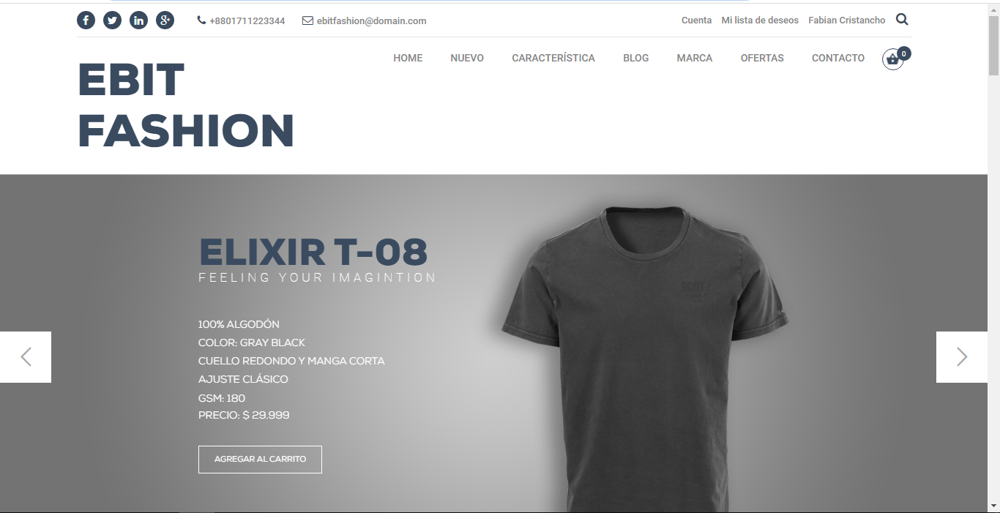
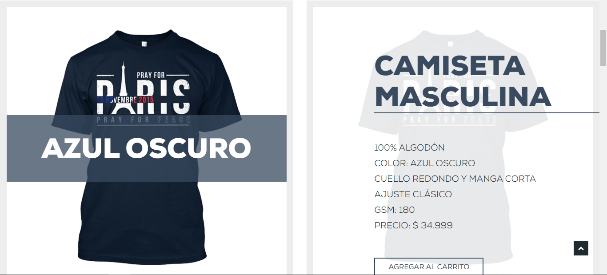
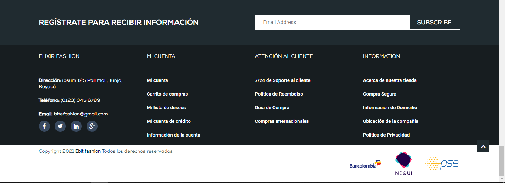
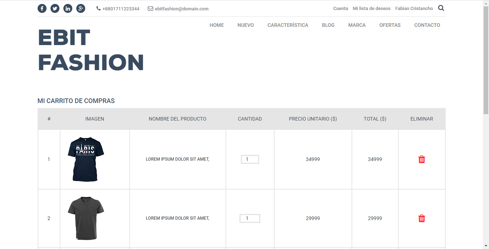
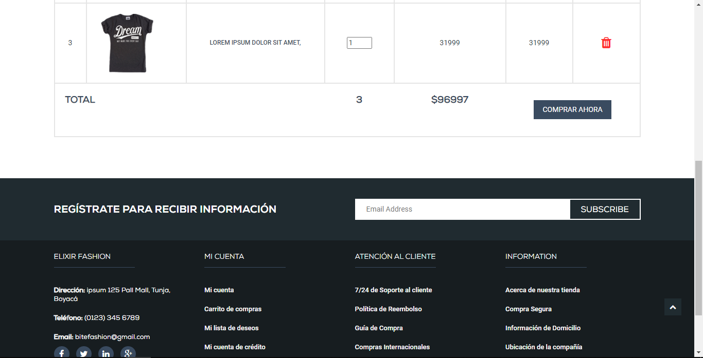

# Pasarela de Pagos - Trabajo de Campo
Implementación de pasarela de pago en página web de ejemplo

## Integración de la pasarela de pago
Para integrar la pasarela de ejemplo a la página web de ejemplo, se hizo uso de la función web checkout ofrecida por la plataforma Wompi (https://docs.wompi.co/docs/en/widget-checkout-web)

Su implementación se encuentra en el archivo denominado "cart-web-checkout.html" que contiene el formulario con los parámetros configurados para que fuera posible la integración.

## Datos de ejemplo 
Para hacer uso de la pasarela, Wompi ofrece unos datos de prueba:
 - Si se elige el pago mediante tarjeta, se deben ingresar los siguientes datos de prueba: 
    
        4242 4242 4242 4242 para una transacción aprobada (APPROVED). Cualquier fecha de expiración en el futuro y CVC de 3 dígitos son válidos.

- Si se elige el pago a través de Nequi, los datos de prueba serán los siguientes:
        
        3991111111 para generar una transacción aprobada (APPROVED)

## Previsualización

Se presentan imágenes relacionadas con el ejemplo dado que simula una página web de comercio electrónico. Si desea probar el demo, por favor visite: https://fabiancristancho.github.io/pasarela-de-pagos/cart-web-checkout.html

### Página principal

### Página de Pagos (Implementación del web checkout)

Gracias por entrar a mi repositorio 😃
